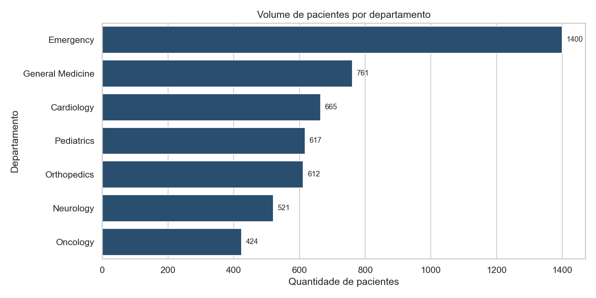
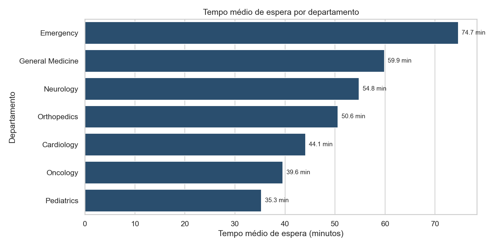
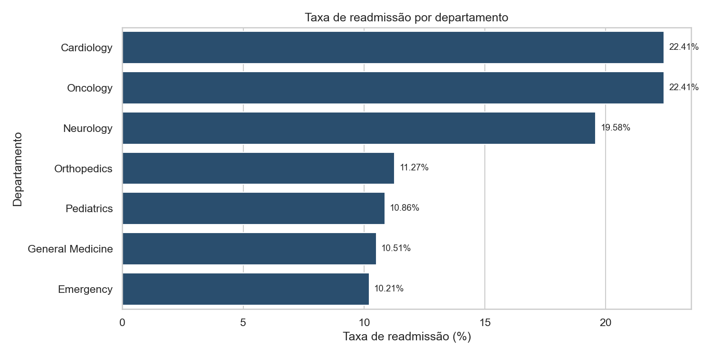
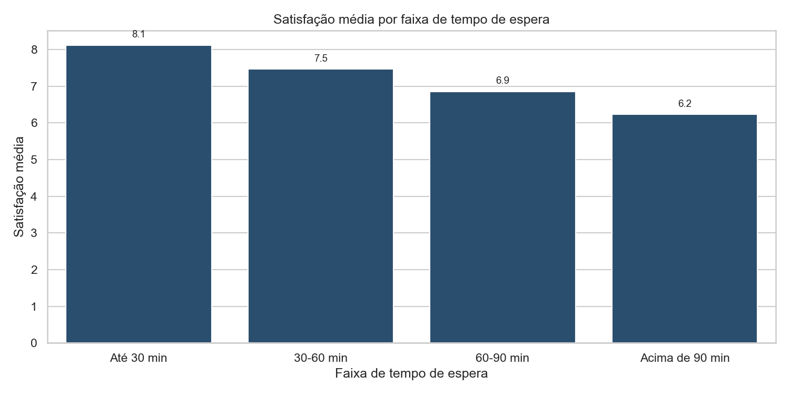

# Análise de Indicadores Operacionais em Saúde

Este projeto é uma análise exploratória de indicadores operacionais em saúde. A ideia foi simular uma análise de atendimentos hospitalares para entender volume de pacientes, tempo de espera, tempo de permanência, readmissão e satisfação.

Usei Python para tratar os dados, criar indicadores e gerar visualizações simples que ajudam a entender a operação de uma unidade de saúde.

## Objetivo

Analisar indicadores operacionais que poderiam ser acompanhados por uma área de operações, qualidade ou BI em saúde.

Perguntas analisadas:

- Qual é o volume de atendimentos por departamento?
- Qual é o tempo médio de espera?
- Quais departamentos têm maior tempo de espera?
- Qual é o tempo médio de permanência dos pacientes?
- Qual é a taxa de readmissão?
- Pacientes readmitidos têm maior tempo de permanência?
- Existe diferença de indicadores por faixa etária?
- A satisfação do paciente muda conforme o tempo de espera?

## Ferramentas usadas

- Python
- pandas
- numpy
- matplotlib
- seaborn
- Jupyter Notebook
- GitHub

## Etapas do projeto

1. Criação de uma base sintética de atendimentos em saúde
2. Carregamento da base
3. Entendimento inicial dos dados
4. Criação de variáveis auxiliares
5. Cálculo de KPIs operacionais
6. Análise por departamento
7. Análise de readmissão e satisfação
8. Criação de gráficos e tabelas
9. Registro dos principais achados

## Principais indicadores

- Total de pacientes
- Tempo médio de espera
- Tempo médio de permanência
- Taxa de readmissão
- Satisfação média
- Volume por departamento
- Readmissão por faixa etária

## Principais achados

- O volume de pacientes se concentra principalmente em Emergency e General Medicine.
- Emergency apresenta alto volume de atendimentos e tempo médio de espera elevado.
- Departamentos como Oncology, Neurology e Cardiology apresentam maior tempo médio de permanência.
- A taxa de readmissão varia entre departamentos e faixas etárias.
- A satisfação média tende a cair conforme aumenta o tempo de espera.

## Exemplos de gráficos

### Volume de pacientes por departamento



### Tempo médio de espera por departamento



### Taxa de readmissão por departamento



### Satisfação por faixa de tempo de espera



## Estrutura do projeto

```text
healthcare-operations-analysis/
├── data/
│   ├── raw/
│   └── processed/
├── notebooks/
│   └── 01_healthcare_operations_analysis.ipynb
├── outputs/
│   ├── charts/
│   └── tables/
├── reports/
│   └── executive_summary.md
├── requirements.txt
└── README.md